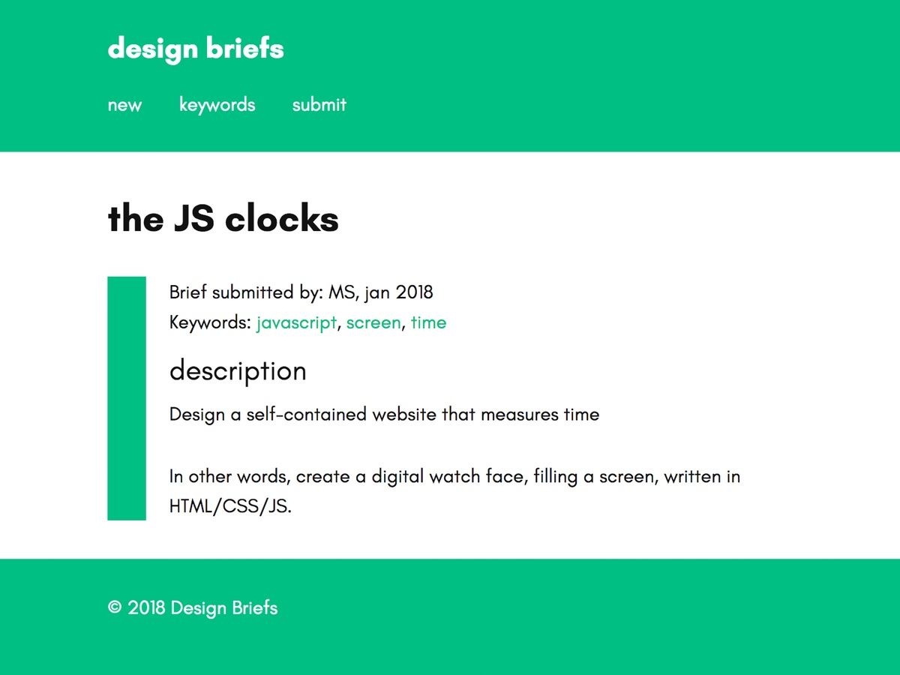

# Design Briefs

WordPress theme for a website that gathers briefs and exercises for design students. The objective is to help teachers come up with new ideas, evaluate what assignments work best and what can be improved, and provide a repository of ready-to-use-concepts



## Technical details

This is a child theme for Davis, by Anders Norén.

## Setup instructions

- Install **Disable Comments** to disable comments functionality.
- **Settings > Permalinks**: rename URL base of tags into "keywords".
- **Settings > General** : change date format from the default (F j, Y) to this: "M Y".

### How are Categories used ?

Not sure yet! At the moment, they are not displayed. We could use them to create a few broad categories, such as "briefs" (default category), "ideas" (for briefs that haven't been carried out yet), "historical" (for briefs derived from the history of design).

### How are Tags used ?

Tags are used to define keywords. They can associate a brief to a more specific field of practice (type design, calligraphy, 3d printing...), a topic (time, emotions, climate...), a tool (css, javascript, arduino...), a medium (screen, video, paper).

## Design

This theme includes a custom typeface: *Glacial Indifference*, by Alfredo Marco Pradil, released under the SIL Open Font License. The OTF font has been converted into webfont formats using FontSquirrel.

## Todo

Allow to post "reports", implementations of a specific brief. Some ways to do that:

1. Make posts hierarchical: a sub-item (post that has a parent) is a report, an implementation of a brief. Like pages and child-pages.
2. Make a separate Custom Post Type, and link them in some way (WP Relationships by JJJ)?
3. Use comments (but we need to add images, rich content...)

**Conclusion:** option 1 (hierachical) is probably the most straightforward. This means: we need to change the behavior of posts, and make them hierarchical.

How are sub-posts (implementations) linked to the brief? The same way as sub-pages to pages: the "post_parent" column holds the parent ID.

How to query for child-posts? Use the "post_parent" argument:

```
$args = array(
    'post_parent'    => $post->ID,
 );
 ```
